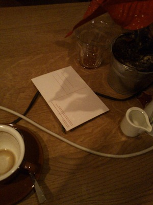

Es gibt ein Bibliothekssystem. Vielleicht auch mehrere
Bibliothekssysteme? Daneben gibt es nachweislich weitere Einrichtungen,
die sich als Bibliotheken verstehen aber nicht als Teil eines
Bibliothekssystems. Kann das sein? Was für Institutionen sind das? Wer
steht hinter solchen Einrichtungen? Haben sie ein Recht, sich Bibliothek
zu nennen oder okkupieren sie diesen Begriff? Muss er ihnen abgesprochen
werden? Und wenn ja, wer hat das Recht dazu und entscheidet dies auf
welcher Grundlage?

Die aktuelle Ausgabe der LIBREAS beantwortet diese Fragen nicht
wirklich, aber sie liefert zumindest einiges an Material dazu. Zum
Beispiel einen Text, in dem sich die Anarchistische Bibliothek & Archiv
Wien vorstellt. In der Redaktion führte er zu einigen Diskussionen. Die
Personen mit eigenen Erfahrungen in der Szene sehen in ihm eine gute
Schilderung des Projektes inklusive seiner politischen Ansprüche. Andere
Teile empfinden die Schilderung in Teilen naiv. Aber was heißt *naiv* in
diesem Zusammenhang? Ist es *naiv*, weil wir als „Professionelle“ es
besser wüssten und zum Beispiel Digitalisierungsprojekte anders planen?
Ist es *naiv*, weil wir als „Professionelle“ anders über Bibliotheken
und deren Funktionen reden, anders planen und andere Punkte wichtig
finden, als das Kollektiv in Wien? Wäre eine solche Differenz nicht
gerade der Kern einer explizit anarchistischen Bibliothek? Ist es also
*naiv*, weil wir und das Kollektiv in gewisser Weise in anderen Welten
leben? Haben wir das Recht dazu, den Text naiv zu nennen und
umzuschreiben? Bestimmt nicht.

Daher beließen wir ihn als Selbstdarstellung so gelassen, wie er jetzt
publiziert ist. Aber diese Episode aus der Redaktionsarbeit zeigt sehr
schön, worum es geht: Darum, Macherinnen und Machern solcher
Bibliotheken außerhalb der offiziellen Bibliothekswesen zu befragen, was
sie von ihren Einrichtungen denken, erwarten und erhoffen. Und dabei von
ihnen zu lernen, blinde Flecken und Lücken bei uns „Professionellen“ zu
entdecken. Zum Beispiel eine Haltung, die andere Einrichtungen im ersten
Moment als naiv beschreibt – wenn auch gleich mit einem unguten Gefühl.

Dabei geht es nicht nur um Einrichtungen, die sich politisch außerhalb
der offiziösen Bibliothekssysteme verorten. Uwe Jung berichtet darüber,
wie das Implementieren von Bibliothekskonzepten, die zumeist in Europa
entstanden sind, in Kamerun regelmäßig scheitert und reflektiert über
Gründe dafür. So einfach ist die Grenze zwischen Gesellschaften offenbar
auch für Bibliothekskonzepte nicht zu überschreiten. Christian Kahle
führt – was gewiss Widerspruch hervorrufen wird – offene Bücherschränke
und Bibliotheken auf künstlerische Interventionen zurück und weist damit
auf ein Denken über Bibliotheken hin, das weder aus dem Bibliothekswesen
stammt noch unbedingt die gleichen Ziele verfolgt. Eliane Blumer und
Karsten Schuldt zeigen einen weiteren Grenzbereich, wenn sie in ihrem
Text die Nutzung von Öffentlichen Bibliotheken in Aufwertungs- und
Verdrängungsprozessen in Lausanne besprechen. Hier wird die Bibliothek
als Kultureinrichtung in größeren Strategien verwendet, dabei aber nicht
auf bibliothekarische Fragen oder Zielsetzungen geachtet. Ben Kaden
berichtet über eine reisende Bibliothek von Zines und reflektiert, wie
solche speziellen Publikationen mit ihrer spezifischen Materialität für
das reguläre Bibliothekswesen kaum greifbar werden können.

Die Snowden-Commons erweitern den Blick noch in eine andere Richtung:
Wie können Materialien, die ungeplant zugänglich werden, in einer
geordneten und verlässlichen Form dauerhaft an eine Öffentlichkeit
vermittelt werden?

Wie gesagt: Wo genau die Grenzen der Bibliothekswesen verlaufen, wer
Diskussions- und Definitionsmacht hat, wird in dieser Ausgabe der
LIBREAS nicht geklärt. Diese Diskussion bleibt also offen. Alternative
Bibliotheken, die sich nicht einem fixen Formen offizieller
Bibliotheksorganisation Rahmen herausbilden, zeigen nicht zuletzt, wo
Bedarfe nicht von dem traditionellem Bibliothekswesen aufgefangen werden
und vielleicht auch nicht aufgefangen werden können. Eine interessante
Erweiterung der Perspektive ergibt sich aus der gern praktizierten
Überführung öffentlicher Bibliotheken in ehrenamtliche Strukturen, die
so auch für die dann ehemaligen Unterhaltsträger nicht mehr kontrolliert
werden können. Es wäre interessant, nachzuforschen, in welchem Umfang
sich bürgerschaftliche Bewegung an beiden Enden des politischen
Spektrums solcher Möglichkeiten bedienen.

Für Spezialbibliotheken wie Zines of the Zone und also Nischenbestände
stellt sich zugleich die Frage der Nachhaltigkeit. Hier werden
Anschlussfragen akut zu stellen sein. Die von Ben Kaden unlängst im
LIBREAS-Tumblr aufgebrachte Idee einer *Library of the Libraries* (vgl.
<http://libreas.tumblr.com/post/104999402491/inside-library>),
die als zentraler Anlaufpunkt auch diese Facetten der Kulturproduktion
auffängt und dokumentiert (idealerweise angeschlossen an einer
Nationalbibliothek) ist sicher nur eine frühe Überlegung.

Die Infrastrukturfrage wird dagegen in der Ausgabe gespiegelt und zwar
im Beitrag zu Open Access Repositorien von Maxi Kindling und Paul
Vierkant. Und schließlich gibt es, fast als Vorgeschmack auf die
Methoden-Ausgabe von LIBREAS, ein Interview über das zunehmend zum
Einsatz kommende Format des so genannten World Cafés am Beispiel des
Weber World Cafés, welches Gesche Schifferdecker im Gespräch vorstellt.

Mit dieser Ausgabe haben wir auch das Design angepasst. Ziel ist es, das Lesen auf dem Handy oder auf dem Tablet besser zu unterstützen. Außerdem haben wir im Sinne des Schutzes der Privatheit die *addThis* Funktionen entfernt.

Wie immer ist nach der Ausgabe vor der Ausgabe. Weitere werden folgen.
Wer uns dabei unterstützen möchte, kann dies sehr gern mit
substantiellen Beiträgen tun. Und natürlich möchten wir auch auf den
LIBREAS-Verein zur Förderung der bibliotheks- und
informationswissenschaftlichen Kommunikation hinweisen. Eine
Mitgliedschaft ist vergleichsweise günstig und hilft uns, Diskussion und
Debatten auch über die Zeitschrift hinaus anzuregen, zu unterstützen und
zu dokumentieren. Informationen zu Verein finden sich unter
<http://www.libreas-verein.eu/>.

Viel Spaß bei der Lektüre und, wenn gewünscht, Diskussionen,

Ihre/eure LIBREAS-Redaktion

(Berlin, Bielefeld, Chur, München, Potsdam)
