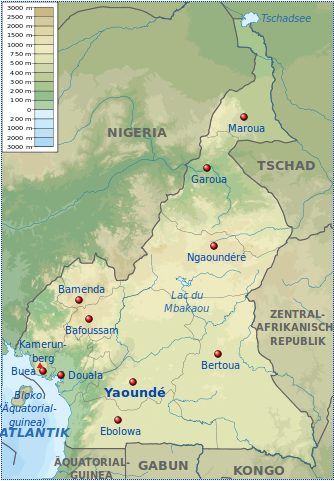
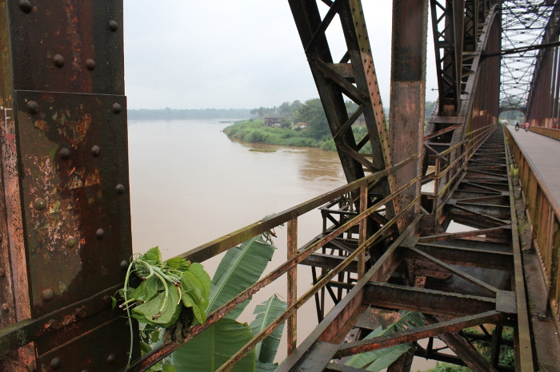
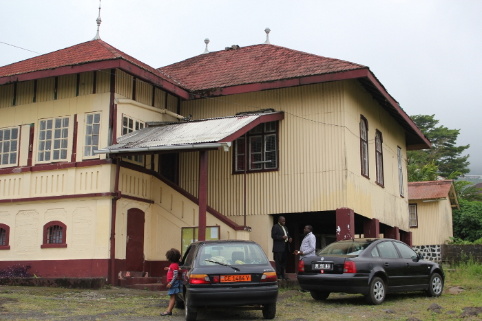
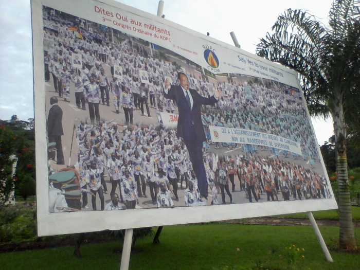
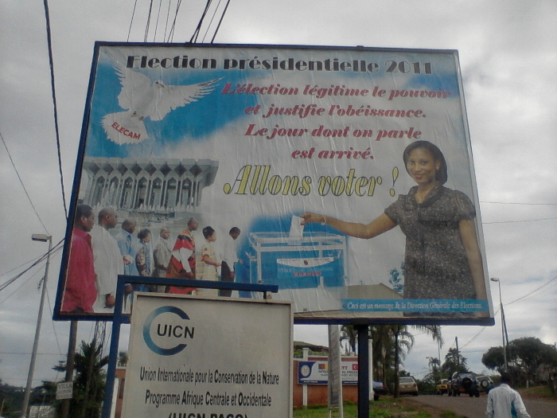
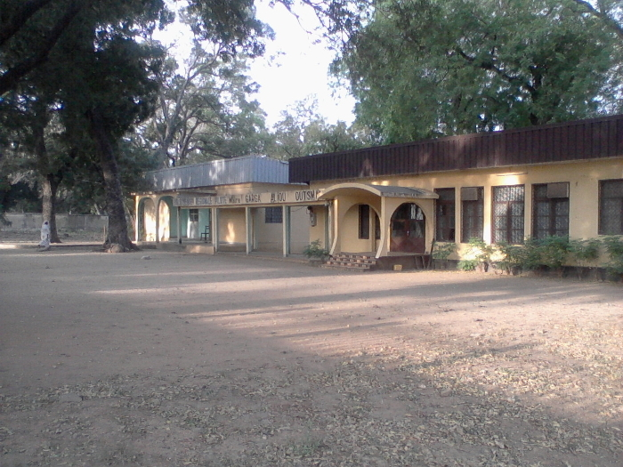
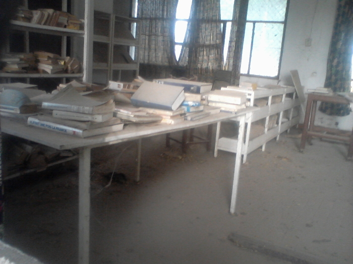
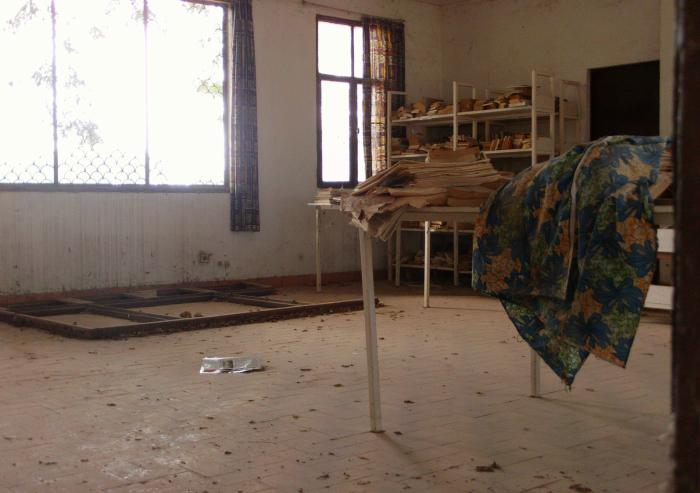
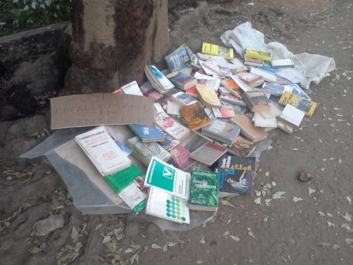

### Ein Anfang

Wer nach alternativen Bibliothekskonzepten fragt, muss sich zunächst
über das Wesen traditioneller Bibliothekskonzepte im Klaren sein. Diese
Frage scheint für weite Teile Europas und Nordamerikas geklärt zu sein.
Doch in einem Land, in welchem der konstruierte Widerspruch zwischen
Tradition und Moderne regelmäßig unter wechselnden Vorzeichen betrachtet
wird, ist dies weniger klar, als gemeinhin angenommen. Der nachfolgende
Text entstand als Ergebnis langjähriger aktiver Beobachtung in der
bibliothekarischen Praxis Kameruns. Obgleich er versucht, einige der
beschriebenen Phänomene ansatzweise theoretisch zu unterlegen, erhebt er
doch keinen Anspruch auf eine umfassende theoretische Erklärung.

Kamerun liegt an der Grenze zwischen West- und Zentralafrika. Das Land
war zwischen 1884 und 1916 eine deutsche Kolonie. Mehr noch, während
dieser Zeit wurden dutzende von verschiedenen lokalen Gesellschaften
zwischen Atlantik und Tschadsee unter einer zentralen Verwaltung
zusammengefasst. Wichtigstes Erbe dieser gemeinsamen Geschichte war
folglich die Schaffung eines Staatswesens, dessen Name und dessen
Grenzen im Wesentlichen noch heute existieren. Nach dem 1. Weltkrieg
wurde das Land in zwei von Großbritannien und Frankreich verwaltete
Mandatsgebiete aufgeteilt, zunächst im Namen des Völkerbundes, später im
Namen der Vereinten Nationen. Dieses Doppelmandat führte unter anderem
dazu, dass die heutige Republik Kamerun in einen dominanten frankophonen
und einen kleineren anglophonen Landesteil unterteilt ist. Anfang der
1960er Jahre wurden beide Mandatsgebiete, euphemistisch ausgedrückt, in
die politische Unabhängigkeit entlassen. Das zunächst föderalistisch
geprägte System wurde 1972 zugunsten eines zentralistischen
Einheitsstaates abgeschafft.

Die gegenwärtige politische Situation ist durch die seit 1982 währende
Amtszeit von Paul Biya gekennzeichnet. Unter dessen Ägide wurde eine
gewisse innenpolitische Stabilität durchgesetzt, die jedoch gleichzeitig
zu einer weitgehenden gesellschaftlichen Stagnation führte. Weitaus
problematischer ist jedoch die sich daraus ableitende
Zukunftsperspektive. Beobachter gehen derzeit davon aus, dass die
aktuelle politische Situation im Zusammenhang mit dem demnächst
anstehenden, jedoch offenbar unvorbereiteten Führungswechsel zu
gewaltsam ausgetragenen Konflikten führen wird.[^1]

Die letzten 130 Jahre haben im Gebiet des heutigen Kameruns zweifellos
tiefgreifende gesellschaftliche Veränderungen hervorgebracht. Es ist
wichtig, darauf hinzuweisen, dass diese Veränderungen zumeist auf das
Wirken äußerer Faktoren zurückzuführen sind. Landläufig wird für diese
Veränderungen oftmals der Begriff der Modernisierung verwendet. Jedoch
ist dieser Begriff gleich in mehrfacher Hinsicht problematisch. Weder
gibt es eine lineare Abfolge gesellschaftlicher Entwicklung vom
"Niederen" zum "Höheren", noch gibt es einen klar voneinander
abzugrenzenden Gegensatz zwischen Tradition und Moderne.[^2] Ist mit
Modernisierung gar gemeint, eine Gesellschaft nach aktuellen westlichen
Maßstäben zu entwickeln, wird der Begriff nicht mehr tragbar. Die
besagten Veränderungen haben in Kamerun vielmehr zu einer spezifischen
kamerunischen Gesellschaft mit eigenen Werten und Formen des
Zusammenlebens geführt. Dies zu erkennen, ist eine wichtige
Voraussetzung dafür, sich lernend mit einzelnen Institutionen und
Phänomenen dieser Gesellschaft beschäftigen zu können.

Das Spezifische der kamerunischen Gesellschaft führt jedoch zugleich zur
Feststellung, dass jede Form von Verallgemeinerung höchst problematisch
ist. Für Kamerun geltende Aussagen können nicht ohne weiteres auf eine
"afrikanische" Gesellschaft übertragen werden. Das Konstrukt "Afrika"
taugt nur bedingt zum Erkenntnisgewinn. Es musste hingegen bereits zu
oft als Vehikel für unzutreffende Verallgemeinerungen herhalten. Das
Ergebnis dessen lässt sich sarkastisch zu dem Klischee vom
Katastrophenkontinent mit fröhlich tanzenden Bewohnern, phantastischen
Landschaften und wilden Tieren zusammenfassen. Oder, wie es der
kenianische Schriftsteller Binyavanga Wainaina sehr pointiert
ausgedrückt hat: "Afrika ist der einzige Kontinent, den man lieben
kann."[^3]

### Bibliotheken in Kamerun

Bibliotheken in Kamerun sind fast immer unter dem Gesichtspunkt von
kolonialen und neokolonialen Auseinandersetzungen zu betrachten. Sie
entstanden und entstehen in den allermeisten Fällen auf der Basis eines
importierten und für allgemeingültig angesehenen Konzepts. Diese Aussage
gilt teilweise sogar für die berühmte vom König Njoya entwickelte
Bamum-Literatur, welche zu einem Zeitpunkt entstand, als die deutsche
Kolonialverwaltung bereits im Lande wirkte.[^4]

Eine der ersten traditionellen (oder sollte man hier besser sagen,
modernen) Bibliotheken in Kamerun entstand mit dem Aufbau der deutschen
Kolonialverwaltung ab 1884. Teile dieser sogenannten
Gouvernements-Bibliothek haben sich bis heute in Buea und Jaunde[^5]
erhalten. Dieser wahrscheinlich ersten "europäischen" Bibliothek sollten
noch weitere folgen. Sie befinden sich hauptsächlich in Schulen und
Hochschulen, in Behörden, in privat organisierten Kulturzentren sowie -
recht vereinzelt anzutreffen - in kommunalen Einrichtungen. Ihre Zahl
ist kaum bekannt. Noch weniger bekannt sind belegbare Daten zur Größe
der Bestände, zur Art der Bestandserneuerung sowie zur Zahl der
Besucher. Das Fehlen dieser Zahlen macht es notwendig, sich auf anderen
Wegen ein Bild vom kamerunischen Bibliothekswesen zu verschaffen, zum
Beispiel durch Besuche, Interviews und Gespräche mit den Akteuren. Der
Autor hat seit etwa zehn Jahren die Möglichkeit, diese Methoden zu
nutzen. Indes ist es auch nach so langer Zeit noch schwierig, sich ein
abschließendes Urteil über das Bibliothekswesen in Kamerun zu erlauben.

Wodurch sind also Bibliotheken in Kamerun beziehungsweise das kamerunische
Bibliothekswesen gekennzeichnet? Nachfolgend der Versuch einer
Charakterisierung:

Wie bereits erwähnt, besteht ein wichtiges Merkmal darin, dass sich
nahezu alle bibliothekarischen Einrichtungen in Kamerun der "modernen"
Sphäre zuordnen lassen.[^6] Gemeint ist ihre Einbettung in den Kontext
von Institutionen, welche erst in den letzten 130 Jahren im Land
entstanden sind. Zu nennen sind hier Schulen und Hochschulen, Behörden
und Kommunalverwaltungen, nationale und internationale
Regierungsorganisationen, das Parlament, aber auch kirchliche Gemeinden
und sekuläre Vereine. Vielen von ihnen ist gemein, dass sie sich als
Gegenentwurf zu lokal überlieferten Formen von Kultur und Gesellschaft
verstehen. Ihr Anspruch bestand und besteht darin, vorgefundene Dinge zu
verändern, vorhandene Strukturen aufzubrechen, Neues zu schaffen, kurz:
die Gesellschaft zu "modernisieren" und "voranzubringen". Die
Anführungszeichen bei einigen der zuvor genannten Begriffe sollen
ausdrücken, dass diese Ansichten nicht von allen in diesen Prozessen
involvierten Akteuren in gleicher Weise geteilt werden.

Viele dieser institutionellen Gründungen und somit auch den meist damit
einhergehenden Bibliotheksgründungen erfolgten direkt oder indirekt
durch ausländische Institutionen. Direkt bedeutet hier, dass bei der
Gründung bereits die ausländische Institution präsent war oder die
Gründung direkt auf den Willen einer ausländischen Institution
zurückgeht. Indirekt bedeutet, dass die Gründung mit der Absicht
erfolgte, formell mit den Entwicklungen im Ausland gleichzuziehen. In
jenem Sinne wurden Bibliotheken vor allem deshalb geschaffen, weil sie
international üblich sind. Man orientierte sich also am Ausland und
kopierte im Wesentlichen die Form. Die Auseinandersetzung mit den
klassischen Funktionen einer Bibliothek rückte dagegen eher in den
Hintergrund.

Außer den Bibliotheken wurden auch einige damit verbundene Strukturen
und Prozesse geschaffen. So gibt es in Kamerun, wie in anderen Ländern
auch, eine Nationalbibliothek mit Pflichtabgabeverordnung, einen
nationalen Bibliotheksverband sowie universitäre Ausbildungsstätten für
Bibliotheksmitarbeiter. Letztere wiederum geben Informationen über
international praktizierte Begriffe, Normen und Prozesse an ihre
Studenten weiter.

Das Ergebnis dieser Gründungsprozesse ist eine Bibliothekslandschaft,
die sich auf den ersten Blick kaum von denen in anderen Ländern
unterscheidet. Erst beim näheren Hinsehen zeigen sich die markanten
Unterschiede von der "internationalen Norm". Mehr noch, die reale
Situation vor Ort führt bei den beteiligten Akteuren nicht selten zu
Reaktionen, die auf den aufgeklärten westlichen Beobachter mitunter
verstörend wirken.

### Probleme?

Zu den Unterschieden gehören zum Beispiel das fast vollständige Fehlen
von Bibliotheksentwicklungsplänen beziehungsweise die ausbleibende Umsetzung dieser
Pläne. Ein planmäßiger Bestandsaufbau findet nur selten statt. Es
dominiert die eher zufällige Bestandserweiterung auf der Grundlage von
Schenkungen. Bei den Schenkungen wiederum handelt es sich nicht selten
um ausgesonderte Titel ausländischer Institutionen. Finden keine
Schenkungen statt, entfällt als Konsequenz auch der Bestandsaufbau. Als
Beispiel soll hier die zentrale öffentliche Bibliothek in Jaunde genannt
werden, für die nach der Gründungsphase 1998 kein einziges neues Buch
mehr angeschafft wurde.[^7]

Auch bei der Betrachtung der Infrastruktur lassen sich Unterschiede
feststellen. Viele Räumlichkeiten wirken wenig einladend auf die
Besucher. Und obgleich die in Kamerun häufig anzutreffende Mischung aus
Staub und hoher Luftfeuchtigkeit viel zu diesem Eindruck mit beiträgt,
liegen die Ursachen hierfür woanders. Budgets für regelmäßige
Bibliotheksreinigung und neues Mobiliar sind selten vorgesehen beziehungsweise
werden - den verschiedenen Gesprächspartnern zufolge - regelmäßig von
Mitgliedern der vorgesetzten Ebene zweckentfremdet.

Des Weiteren wird der im Alltag häufig anzutreffende autoritäre
Führungsstil vielerorts auch in Bibliotheken praktiziert.
Bibliotheksnutzer finden sich deshalb nicht selten in der Rolle von
Subjekten wieder, die den Betrieb eher stören als bereichern. Ein immer
wieder zu hörender Satz lautet entsprechend "Les enfants-là
dérangent !",[^8] wobei die besagten Kinder gut und gerne auch mal 30
Jahre alt sein können. Unter diesen Umständen das Ideal der Förderung
eines allseitig informationskompetenten Bürgers herauslesen zu wollen,
erscheint wenig realistisch. In diesem Zusammenhang darf auch vermutet
werden, dass eine breite Masse von selbstständig und kreativ handelnden
Individuen im Grunde genommen in Kamerun kein Ziel staatlichen Handelns
darstellt. Permanente Innovation sowie das stete infrage stellen der
bestehenden Ordnung würden einen hohen Mitteleinsatz bei der
Aufrechterhaltung ebendieser Ordnung bedingen. Der Vorteil einer
durchgängig autoritär organisierten Gesellschaft besteht hingegen genau
darin, dass sich die bestehende gesellschaftliche Ordnung mit relativ
geringem Mitteleinsatz aufrechterhalten lässt. Freilich nur bis zu einem
gewissen Grad. Im Übrigen stellt der Kern dieses Prinzips ein weiteres
Erbe kolonialer Praxis dar. Die koloniale Beherrschung eines knapp
500.000 km² großen Raumes mit kaum mehr als 100 europäischen Militärs
wäre anders nicht denkbar gewesen.[^9]

Kaum besser steht es um die gesellschaftliche Anerkennung der
bibliothekarischen Berufe. In vielen Schulen, aber nicht nur dort, wird
mancher leistungsschwache Mitarbeiter "zur Erholung" in die Bibliothek
versetzt. Generell genügen die Gehälter der Mitarbeiter oftmals nicht,
um sich und der Familie ein bescheidenes Leben zu sichern. Die Folgen
davon sind häufige Abwesenheiten zwecks Nebenerwerb beziehungsweise wegen
mangelnder Motivation. Hat man zudem das "Glück" als Beamter angestellt
zu werden, braucht es in der Regel zwei bis drei Jahre, bis das erste
Gehalt ausgezahlt wird. Einen Teil dieser unfreiwilligen Wartezeit
verbringt der Bittsteller dann nicht an seinem Arbeitsplatz, sondern in
der Hauptstadt mit dem Putzen unzähliger Türklinken in diversen
Ministerien. Über dieses Problem berichten nicht nur
Bibliotheksmitarbeiter, sondern auch andere angehende Beamte, wie zum
Beispiel Lehrer.

Auch bei der bibliothekarischen Ausbildung werden Unterschiede zur
"Norm" sichtbar. Die Studiengänge einiger Einrichtungen sind unter
anderem durch fehlenden Praxisbezug sowie veraltete Lerninhalte
gekennzeichnet. Zum Beispiel lernten angehende Dokumentare und
Bibliothekare noch 2013 in der staatlichen Ausbildungsstätte ESSTIC,
dass es in Deutschland zwei Nationalbibliotheken gibt, eine davon in der
DDR (!). Des Weiteren endete ein Kurs zum Thema "Multimedia in der
Bibliothek" mit der Erwähnung der Video-Disc als neueste Entwicklung auf
diesem Gebiet.[^10] In der Tat sind die Vorlesungen mancher Dozenten
kaum mehr als die Zusammenstellung ihrer eigenen, während der
Studienzeit angefertigten Mitschriften.

Was Projekte im Bibliotheksbereich betrifft, so gibt es hier kaum
Unterschiede zu anderen gesellschaftlichen Bereichen im Land.
Protokollarische Details und die Dicke von zugestanden Geldumschlägen
erscheinen im Alltag wichtiger als das eigentliche Projektziel.
Angesichts der gesellschaftlichen Bedeutung von Essenseinladungen
verwundert es auch nicht, dass die Qualität und Quantität der kostenlos
angebotenen Speisen und Getränke mitunter über den Erfolg oder
Misserfolg einer organisierten Weiterbildungsveranstaltung entscheidet.

Die Ergebnisse solcher Projekte und Workshops lassen sich dann
gegebenenfalls an der Größe der entstandenen Ruinen messen. So gibt es
zum Beispiel in Marua eine aus einem internationalen Projekt heraus
entstandene öffentliche Bibliothek zu bewundern, die irgendwann vor
Jahren schlichtweg von Mitarbeitern und Besuchern verlassen wurde. Seit
diesem Tag warten Bücher, Regale, Stühle und Tische darauf, unter einer
dicken Staubschicht begraben zu werden, um dann womöglich irgendwann in
der Zukunft Gegenstand einer archäologischen Ausgrabung zu werden.
Wohlgemerkt, es handelt sich um die zentrale Öffentliche Bibliothek für
Marua und die Region Extrême-Nord, immerhin ein Gebiet mit über drei
Millionen Einwohnern![^11] Marua ist dabei leider kein Einzelfall. Die
Tageszeitung "Mutations" berichtete in ihrer Ausgabe vom 14. Oktober
2014 darüber, dass es in Bertua, immerhin Hauptort der flächenmäßig
größten Region Est, derzeit keine einzige Bibliothek gäbe. Der Autor der
"Mutations" bezieht sich hierbei im Wesentlichen auf die dort ebenfalls
geschlossene Öffentliche Bibliothek. Über die Existenz einiger kleinerer
Bibliotheken scheint er hingegen nicht informiert zu sein.

Angesichts dieser bisher beschriebenen Umstände mag es wenig verwundern,
dass die Nationalbibliothek des Landes seit fast 10 Jahren für die
Öffentlichkeit geschlossen ist und der seit 1973 Jahren existierende
nationale Bibliotheksverband ABADCAM (Cameroon Association of
Librarians, Archivists, Documentalists and Museographers) erst 2010 im
Rahmen des IFLA-BSLA-Programms[^12] reanimiert wurde.

### Ein Erklärungsversuch

Es wäre langweilig und wenig nutzbringend, sich weiter bei der
Aufzählung von Problemen aufzuhalten, die - jedes für sich allein
genommen - sicherlich auch in anderen Ländern festgestellt werden
können.[^13] Generell ersichtlich wird allerdings ein systematisches
Abweichen vom Normalen, wobei die nicht erfüllten Normen außerhalb des
Landes definiert werden. Betrachtet man folglich das Bibliothekswesen in
Kamerun unter dem Gesichtspunkt, wie "es eigentlich sein müsste",
bleiben Enttäuschungen nicht aus. Von den beteiligten Akteuren vor Ort
hört man jedoch in Bezug auf diesen oder jenen Umstand immer wieder die
Aussage: "C'est normal !"[^14] Allein diese ständig wiederkehrende
Floskel deutet bereits darauf hin, dass die extern aufgestellten Normen
mit denjenigen Normen, wie sie im Land selbst definiert und von den
beteiligten Akteuren wahrgenommen werden, nicht übereinstimmen. Ganz
offensichtlich befolgen viele Akteure im kamerunischen Bibliothekswesen
gänzlich andere Normen, wobei sie daran durch ihre jeweils Aufsicht
führenden Einrichtungen kaum behindert werden.

Konkret führt dies zu der These, wonach das aus Europa beziehungsweise Nordamerika
eingeführte Konzept der Bibliothek in Kamerun vielerorts abgeändert und
den Bedürfnissen von einigen der beteiligten Stakeholder angepasst
wurde. Diese Umwandlung erfolgte an einigen Orten so erfolgreich, dass
die ursprüngliche Funktionalität der "Bibliothek" nahezu komplett
dahinter verschwand. Im Extremfall berechtigt das Vorhandensein eines
angestaubten Regals mit einigen unattraktiven – und daher noch nicht
gestohlenen – Büchern zum Bezug eines regelmäßigen Beamteneinkommens
nebst der Aussicht auf Dienstreisezulagen und ab und an anfallenden
Projektgeldern. Im Normalfall ist der Extremfall ein erstrebenswertes
Ziel, wobei es dann auch gerne noch ein paar Regale mehr sein dürfen.

In diesem Sinne stellt diese Art von Organisation eine Alternative zum
importierten und scheinbar universell geltenden Bibliothekskonzept dar,
freilich ohne dass die in Europa und Nordamerika definierten klassischen
Funktionen einer Bibliothek darin noch irgendwie ernsthafte Beachtung
fänden.

An dieser Stelle sei vor Missverständnissen gewarnt. Die hier
beschriebenen Fälle mögen vielleicht für die Mehrzahl der mit dem
Begriff "Bibliothek" umschriebenen Einrichtungen in Kamerun zutreffen,
für die Gesamtheit stimmt dies nicht. Es gibt sehr wohl ernsthafte
Bibliotheksprojekte mit engagierten Kolleginnen und Kollegen, die dort
ihre Angebote den Nutzern zukommen lassen. Es würde sich sicher lohnen,
die möglicherweise gemeinsamen Voraussetzungen für diese, von außen
betrachtet, wünschenswerte Praxis mit wissenschaftlichen Methoden näher
zu untersuchen. Als eine erste Hypothese bietet sich eine angenommene
Korrelation zwischen "erfolgreichen" Bibliotheken und einer gewissen
finanziellen Unabhängigkeit der jeweiligen Verantwortlichen an.

Und auch ein weiteres Missverständnis muss hier geklärt werden. Das
eventuell anzuprangernde Verhalten der Mehrzahl der Kollegen und
Kolleginnen ist nicht etwa persönliche Unfähigkeit oder – noch schlimmer
– einer gruppenspezifischen Unfähigkeit als "Afrikaner" geschuldet.
Vielmehr handeln die jeweiligen Kollegen streng rational, nämlich auf
den Vorteil für sich selbst und für Mitglieder ihrer Netzwerke
ausgerichtet. Besagte Netzwerke können sich ethnisch, religiös oder aber
zum Beispiel auf der Basis von Altersklassen konstituieren. Die
Integration in diese Netzwerke entscheidet in den Augen der Beteiligten
weit stärker über deren persönlichen Zukunftsperspektive, als dies ein
abstrakt vermittelter gesamtgesellschaftlicher Nutzen von Bibliotheken
vermag.

Um es noch einmal klar zum Ausdruck zu bringen: Die meisten Bibliotheken
in Kamerun basieren auf der Übernahme eines scheinbar universellen – in
Wirklichkeit jedoch hauptsächlich im neuzeitlichen Europa beziehungsweise
Nordamerika generierten – Konzepts von Bibliothek. Dieses Konzept wurde
und wird von einzelnen Stakeholdern aktiv und kreativ den eigenen
Bedürfnissen angepasst und zwar so, dass zentrale Funktionen des
ursprünglichen Konzepts an Bedeutung verlieren beziehungsweise ganz aufgegeben
werden.

Radikal betrachtet unterscheidet sich dieses Verhalten nur wenig vom
deutschen Kleingartenbesitzer, der sich eine Buddhafigur zwischen die
Beete stellt. Hier wie dort, wird aktiv importiert, das heißt es werden
nur diejenigen Teile eines Konzepts übernommen, die für den "Importeur"
nützlich und sinnvoll erscheinen.[^15] Es wäre vermessen und im Grunde
genommen Ausdruck einer kolonialen Denkweise, würde der "Exporteur" auf
die detailgetreue Übernahme seines Konzepts beharren. Genau das ist
jedoch leider in der Praxis noch viel zu häufig der Fall.

In der Postkolonialismus-Debatte werden die hier beschriebenen Phänomene
dem Konzept der Hybridisierung zugeordnet. Homi K. Bhabha, auf den
dieses Konzept zurückgeht, sieht im Grenzbereich zwischen zwei Kulturen
Gestaltungsmöglichkeiten und Freiräume für Gruppen und Individuen im
Rahmen eines sogenannten *Third Space.* Es handelt sich um einen neu
entstehenden Raum zwischen dem ersten Raum des globalen Nordens und dem
zweiten Raum des globalen Südens.[^16] Bhabha, dessen biographischer
Hintergrund ihn teilweise selbst zum Bewohner dieses dritten Raumes
macht, kann diesem überwiegend positive Eigenschaften abgewinnen. Und
zweifellos entwickeln die aufgeführten Akteure in den kamerunischen
Bibliotheken ihre Strategien und Freiräume auf der Basis ihres Spiels
zwischen den Kulturen. Ob sie jedoch zugleich als Vermittler zwischen
diesen Kulturen auftreten können und wollen erscheint hingegen fraglich.

### Vorschläge für die Praxis

Was bedeutet nun die hier aufgestellte These für die Praxis, genau
genommen für die aus der Perspektive des Außenstehenden erlebte Praxis?
Es wird hier schnell deutlich, dass die festgestellten Widersprüche in
der Strategie und dem Verhalten des "Exporteurs" Berücksichtigung finden
müssen. Es wird aber auch deutlich, dass diese Widersprüche unter den
jetzigen Bedingungen kaum aufgelöst werden können. Die Beziehungen des
ersten Raumes zum dritten Raum, zwischen "Exporteur" und "Importeur",
sind in vielen Fällen zu asymmetrisch, als dass sich dadurch viel Neues
zu beiderseitigem Vorteil entwickeln könnte. Trotzdem soll hier eine
Sammlung von Prämissen und Handlungsmaximen zur Diskussion gestellt
werden:

1.  Das zur Diskussion stehende Konzept einer Bibliothek als Ort des
    Sammelns, Bewahrens, Zugänglichmachens und Vermittelns von
    Information mag nach der im globalen Norden vorherrschenden Theorie
    universell gültig erscheinen. Es entspringt jedoch einer
    spezifischen kulturhistorischen Entwicklung und ist deshalb in der
    Praxis nicht ohne weiteres auf andere Kulturen übertragbar. Erst
    recht nicht dort, wo die kollektive Erinnerung an einem oftmals
    gewaltsamen, asymmetrischen Kulturaustausch, wie es dem kolonialen
    System zu eigen ist, noch lebendig ist.

2.  Die zweifellos existierenden praktischen Vorteile des westlichen
    Konzepts von Bibliothek können und sollen beworben werden. Ein
    bedingungsloses Beharren auf deren notwendige praktische Umsetzung
    ist jedoch fehl am Platze. Als solche Vorteile seien hier unter
    anderem genannt: die Speicherung von Informationen unabhängig von
    menschlichen Übermittlern, der verbesserte und möglichst frei
    gestaltete Zugang zu diesen Informationen sowie das Auftreten von
    Bibliotheken als Orte des informellen Lernens.

3.  Die Entwicklung eines lokal angepassten Konzepts mit unbedingter und
    maßgeblicher Beteiligung der betroffenen Akteure sollte aufmerksam
    beobachtet und gegebenenfalls auch gefördert beziehungsweise unterstützt
    werden. Dabei kommt der Förderung des fachlichen Dialogs auf
    nationaler und internationaler Ebene eine besondere Bedeutung zu.
    Der Dialog bietet gute Voraussetzungen für gangbare Lösungen unter
    rechtzeitigem Ausschluss von Fehlentwicklungen. Es ist jedoch klar,
    dass die im Dialog ausgehandelten Verfahren irgendwann auch in die
    Praxis umgesetzt werden sollten.

4.  Die beteiligten Kollegen und Kolleginnen vor Ort müssen als
    selbstständig und rational handelnde Akteure in ihrem jeweiligen
    Kontext wahrgenommen werden. Obwohl es eigentlich eine
    Selbstverständlichkeit ist, verdient es dieser letzte Satz,
    besonders betont zu werden.

5.  Einmischung von außen im Sinne von bewussten oder unbewussten
    Vorgaben sollte vermieden werden. Dabei werden häufig gerade die
    Auswirkungen von unbewussten Vorgaben unterschätzt. So führt zum
    Beispiel die an die Bibliotheksmitarbeiter signalisierte
    Erwartungshaltung, was als gute Bibliotheksarbeit gilt und was
    nicht, nicht selten zu vorauseilendem Gehorsam beim Partner. Das
    Ergebnis dessen ist, dass der eigentliche Kern des Problems in der
    Diskussion nicht angesprochen wird. In diesem Sinne wäre das Wagen
    von mehr Abstand ein denkbarer Weg zur Entwicklung von
    selbstständigen und tragfähigen lokal entwickelten Konzepten.
    *Abstand* bedeutet in diesem Sinne zum einen den freiwilligen
    Verzicht auf latente beziehungsweise manifeste Einmischung der stärkeren Seite
    in Bezug auf die sich anbietenden Problemlösungsoptionen. *Abstand*
    bedeutet aber auch, dass die scheinbar schwächere Seite sich die
    Möglichkeit offen hält, eigene Problemlösungsstrategien zu
    entwickeln. Es ist jedoch fraglich, ob diese beiden hier
    angesprochenen Aspekte von *Abstand* angesichts der materiellen und
    damit machtpolitischen Ungleichgewichte überhaupt in der Praxis
    umgesetzt werden können.

Probleme bei der Sammlung, Aufbewahrung, Zugänglichmachung und
Vermittlung von Informationen sind auch in der kamerunischen
Gesellschaft zweifellos vorhanden. Ein Rückgriff auf vorkoloniale Formen
des Informationsmanagements scheint nicht möglich. Die hundertprozentige
Übernahme westlicher Konzepte erweist sich hingegen als eine Illusion.
Die Lösung dürfte in der Entwicklung angepasster Konzepte mit Blick auf
den gesamtgesellschaftlichen Nutzen sowie in der Unterstützung durch
Staaten entwickelter Bibliothekssysteme liegen. Die Initiative hierzu
muss aus dem Inneren der kamerunischen Gesellschaft heraus erfolgen.
Dazu wiederum muss den Akteuren mehr intellektuelle Eigenständigkeit
zugebilligt werden. Folglich muss die Ausbildung gemäß der aktuellen
Praxis und des wissenschaftlichen Diskurses angepasst werden.

Es ist interessant zu sehen, wie in den letzten Jahren Forderungen nach
mehr intellektueller Eigenständigkeit (oder besser Unabhängigkeit)
massiv in die gesellschaftlichen Diskussionen Einzug gehalten haben.
Hauptsächlich spielen diese Forderungen im Rahmen der eingangs erwähnten
kommenden politischen Auseinandersetzungen eine Rolle. Es ist jedoch
noch nicht abzusehen, inwiefern sie die reale gesellschaftliche
Entwicklung beeinflussen und ob sie auch das Bibliothekswesen erreichen
werden. Unter der Voraussetzung, dass es dabei friedlich zugeht, wäre
dies zu wünschen.

[^1]: International Crisis Group (ed.): *Cameroon: Prevention is Better
    than Cure*. Africa Briefing N°101, 4 September 2014
    <http://www.crisisgroup.org/en/regions/africa/central-africa/cameroon.aspx>
    (besucht am 11.10.2014).

[^2]: Zum Problem der Modernisierung von Gesellschaften gibt es
    verschiedene Denkrichtungen und eine umfangreiche Literatur. Von
    besonderer Bedeutung ist hierbei das Theoriensystem des
    Postkolonialismus. Siehe hierzu auch: Kerner, Ina: *Postkoloniale
    Theorien zur Einführung*. Hamburg 2012-

[^3]: Binyavanga Wainaina: *Hungersnöte sind gut. Über Afrika schreiben
    – eine ironische Anleitung*. In: Fluter. Online-Ausgabe vom 1.2.2006
    <http://www.fluter.de/de/afrika/thema/4704/> (besucht am
    29.09.2014).

[^4]: Sultan Njoya von Bamum (Fumban) begann Ende des 19 Jh. mit der
    Entwicklung eines eigenen Schriftsystems, der sogenannten
    Bamum-Schrift. Der direkte Kulturkontakt mit der deutschen
    Kolonialadministration erfolgte erst einige Jahre später. Es kann
    jedoch davon ausgegangen werden, dass Njoya bereits zu Beginn dieses
    Prozesses über die Bedeutung von Schrift als Mittel zur kolonialen
    Herrschaftssicherung einigermaßen informiert war. Michael Everson
    and Charles Riley: *Preliminary proposal for encoding the Bamum
    script in the BMP of the UCS*. 2007
    <http://std.dkuug.dk/jtc1/sc2/wg2/docs/n3209.pdf> (besucht
    am 11.10.2014).

[^5]: Im Text werden die Geografika konsequent in deutscher Schreibweise
    wiedergegeben, falls hierfür eine amtliche Übersetzung vorliegt. Es
    sollte aber klar sein, dass sowohl diese, als auch die aktuellen
    französischen und englischen Schreibweisen Produkte kolonialer
    Verwaltung darstellen. Teilweise existieren lokale Bezeichnungen,
    wie z. B. Ongola für Jaunde (Yaoundé, Yaounde). Jedoch verbergen
    sich auch dahinter koloniale Phänomene und sind diese international
    nicht gebräuchlich.

[^6]: Es soll nicht unerwähnt bleiben, dass es bereits vor 1884 im
    Norden des heutigen Kameruns Palastbibliotheken beziehungsweise schriftliche
    Chroniken gab. Siehe auch: Hunwick, John O., und Rex Séan O’Fahey:
    *Arabic Literature of Africa: The Writings of Central Sudanic Africa
    Vol.2. Volume 13*. BRILL, 1995.

[^7]: Diese und einige der folgenden Information entstammen wiederholten
    Gesprächen mit Mitarbeitern der genannten Einrichtungen sowie
    Besuchen vor Ort.

[^8]: "Die Kinder da stören beziehungsweise nerven!"

[^9]: Hoffmann, Florian: *Okkupation und Militärverwaltung in Kamerun:
    Etablierung und Institutionalisierung des kolonialen Gewaltmonopols
    1891-1914*, Cluvert 2007.

[^10]: Die beiden hier genannten Beispiele entstammen den
    Vorlesungsskripten einer Kollegin, die seit 2013 einen
    berufsbegleitenden Fernstudiengang zur Erlangung einer *Licence
    Professionnelle* an der ESSTIC (École Supérieure des Sciences et
    Techniques de l'Information et de La Communication) absolviert. Sie
    stellen sicherlich Extremfälle dar, deuten aber grundsätzlich auf
    veraltete Lehrinhalte hin.

[^11]: Institut National de la Statistique du Cameroun: *La Population du Cameroun en 2010*. o.J.
    <http://statistics.cameroon.org/news.php?id=18> (besucht am
    25.10.2014).

[^12]: IFLA: *BSLA Country Project: Cameroon*
    <http://www.ifla.org/bsla/country-reports/cameroon>
    (besucht am 11.10.2014).

[^13]: So hat zum Beispiel der Autor im August 2013 die Webauftritte der
    Nationalbibliotheken von 50 afrikanischen Ländern untersucht. Von
    diesen hatten 22 Länder eine Nationalbibliothek mit Webpräsenz. 16
    dieser Webpräsenzen wurden seit 2010 mindestens einmal inhaltlich
    aktualisiert. Auf sechs Webpräsenzen bestand die Möglichkeit einer
    OPAC-Recherche. Dabei handelte es sich mit Kenia, Malawi, Mauritius,
    Namibia, Rwanda und Südafrika jeweils um Länder, in denen Englisch
    Amtssprache ist.

[^14]: "Das ist normal!"

[^15]: Wir gehen dabei davon aus, dass sich der durchschnittliche
    deutsche Buddhafigurenbesitzer nicht umfassend mit den religiösen
    Grundsätzen des Buddhismus identifiziert.

[^16]: Bhabha, Homi K.: *The Location of Culture*. 1994. London:
    Routledge.
