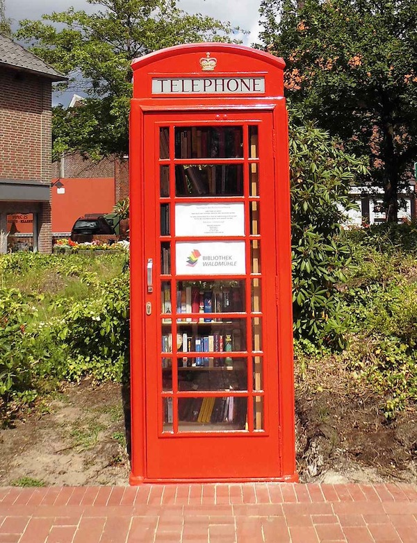
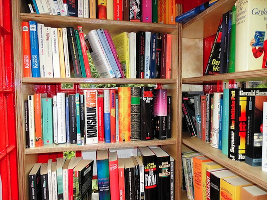
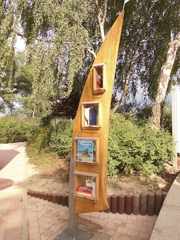
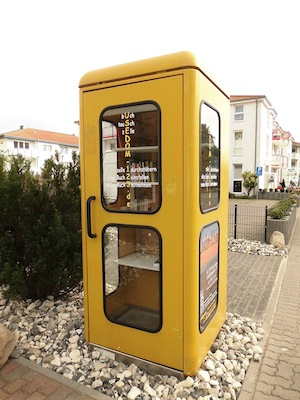

*Offene* oder *Öffentliche Bücherschränke* und vergleichbare
Installationen, die dem freien Austausch von Büchern dienen, gehören
heute zum Alltagsbild vieler Städte. Auf der Plattform
*OpenBookCase.org* sind mittlerweile mehr als 700 Projekte verzeichnet,
die sich überwiegend frei zugänglich im öffentlichen Raum befinden. Die
meisten dieser Mikroinstitutionen stellen Variationen einer Kernidee
dar, die sich auf die Projekte der Künstler *Martin Clegg* und *Michael
Guttmann* zurückführen lässt.

### Die *Offene Bibliothek*

Frei zugängliche Bücherbehältnisse installierte das Künstlerduo *Clegg &
Guttmann* 1991 an verschiedenen Standorten in Graz. In der Zeitschrift
des *Grazer Kunstvereins* veröffentlichten die Künstler einen
theoretischen Entwurf zu ihrer Alternativbibliothek:

> Eine Bibliothek ohne Bibliothekare und Überwachung, deren Bücherbestand
von den Benützern selbst durch ein Tauschsystem, demzufolge jedes
entliehene Buch nach Gutdünken des Benützers durch ein anderes zu
ersetzen ist, bestimmt wäre. (Clegg & Guttmann 1990)

Das Tauschsystem hebt die Rollenhierarchie zwischen dem Fachpersonal
einer Bibliothek und ihren Benutzern auf. Jeder Beteiligte ist
gleichermaßen Nutzer und Erneuerer des gemeinsamen Buchbestands. Die
Offenheit derartiger Bücherbehältnisse liegt nicht allein in ihrer
öffentlichen Zugänglichkeit begründet. In den englischsprachigen Texten
der Künstler fällt die doppelte Bestimmung als *Open Public Library*
auf. Anlässlich einer späteren Realisierung ihrer *Offenen Bibliothek*
stellten *Clegg & Guttmann* folgende Leitlinien auf:

> 1. Die 'Offene Bibliothek' soll ohne Hierarchie auskommen. 
> 2. Die 'Offene Bibliothek' soll durch keinerlei Sicherheits- oder
Kontrolleinrichtungen geschützt werden. 
> 3. Den Nutzern werden keine
zusätzlichen Bestimmungen auferlegt, die über die Definition der
Bibliothek als einen Ort, an dem für einen begrenzten Zeitraum zu
vergebendes Lesematerial zur Verfügung steht, hinausgehen. 
> 4. Es werden
keine Kriterien für eine Auswahl des Lesematerials festgelegt. (Clegg & Guttmann, Bemerkungen zur Offenen Bibliothek, in: Könneke 1994,
S. 28.)

Der gegebenen Minimaldefinition nach kann prinzipiell eine Vielzahl an
Orten, Behältnissen oder Installationen zu einer *Offenen Bibliothek*
erklärt werden. Wie aber wird aus einer Menge an zusammengetragenen
Büchern ein Bestand und somit der Ort zu einer Bibliothek? Mit der
Etablierung spezifischer Formen der Nutzung durch eine
Nutzergemeinschaft, die sich im Zuge sozialer Kommunikationsprozesse
konstituiert:

> Die Notwendigkeit, Normen für die ordnungsgemäße Benutzung der
Bibliothek zu erstellen, wird eine Diskussion über die Werte und Ziele
der Gemeinschaft erforderlich machen. Die Findung und Ausübung von
gewaltlosen Sanktionen gegen die Verletzung des richtigen Gebrauchs der
Bibliothek kann zu einer Übung in metaphorischer Selbstverwaltung
werden. (Clegg & Guttmann 1990)

Kurz sei hier auf den Diskurs über Gemeingüter verwiesen: Ist es
sinnvoll, den geteilten Buchbestand als *Commons* und die damit
verbundenen Formen der Nutzung und Pflege als *Commoning* zu verstehen?
Problematisch ist hier vielleicht die genaue Bestimmung des Gemeinguts,
da für die Nutzer kein konstanter Zugriff auf inhaltlich bestimmte
Wissensbestände garantiert werden kann.

### Porträt einer Gemeinschaft

Ursprünglich waren die *Offenen Bibliotheken* als experimentelle Modelle
gedacht. Als temporäre Installationen sollte sich an ihnen zeigen, in
welcher Form die Anwohner auf ein derartiges Angebot reagieren würden.
Etwaige Plünderungen oder Beschädigungen stellten kein Scheitern,
sondern einen möglichen Verlauf des Experiments dar. Heute werden die
Projekte bewusst so geplant und gepflegt, dass sie für einen längeren
Zeitraum stabil und attraktiv bleiben. Dies führt jedoch zu einer
Einschränkung ihres basisdemokratischen Charakters.

Ausgehend von *Marcel Duchamps* Entgrenzung des überkommenen
Kunstbegriffs werfen *Clegg & Guttmann* die Frage auf, inwiefern ihre
Installationen als Kunst verstanden werden können. Ein *Öffentlicher
Bücherschrank* stellt einen zur kollektiven Nutzung in den Außenraum
verschobenen Gebrauchsgegenstand dar, an dem sich soziale Prozesse
manifestieren:

> Eine solche Bibliothek könnte als Institution zu einer Selbstdefinition
der Gemeinschaft beitragen; sie würde ihre Lesegewohnheiten und
intellektuellen Vorlieben widerspiegeln und wäre damit eine Art Porträt
einer Gemeinschaft. (Ebd.)

Für den Aufbau und Erhalt einer *Offenen Bibliothek* wirken verschiedene
soziale Akteure zusammen, wofür *Clegg & Guttmann* den von *Joseph
Beuys* geprägten Begriff der *sozialen Skulptur* aufgreifen. In Hamburg
richteten die Künstler parallel zu ihren Installationen ein gemeinsames
Informations- und Dokumentationszentrum ein, um eine
Kommunikationsverbindung zwischen den beteiligten Bevölkerungsgruppen zu
schaffen:

> Wir glauben, daß eine der wichtigsten Aufgaben von Kunst ist, Porträts
zu erzeugen, während über den Prozeß des Porträtierens selbst
reflektiert wird. […] Dieses Projekt ist von uns gedacht als ein Porträt
eines Stadtteils. Es wird den Leuten in den verschiedenen Stadtteilen in
sehr direkter Weise ermöglichen, ihren unmittelbaren sozialen Kontext
besser zu verstehen. Würde man es erweitern, könnte das Projekt zu einem
Porträt der Stadt Hamburg werden. (Clegg & Guttmann 1993)

Ein Porträt ist hier kein mit den Mitteln der Malerei geschaffenes
Kunstwerk statischer Referenz. Kunst besteht hier im Anbahnen und
Ermöglichen von Bewusstseins- und Kommunikationsprozessen.

### Variationen und Weiterentwicklungen

*Martin Clegg* und *Michael Guttmann* haben viel mit der *Offenen
Bibliothek* experimentiert. Eine besondere Umsetzung der *Offenen*
*Bibliothek* stellen die Installationen auf dem *Jüdischen Friedhof
Krems* dar. Der Ort und seine Geschichte bildeten hier die Grundlage für
die inhaltliche Auswahl der Buchbestände:

> The Jewish cemetery in Krems has been unused since World War II. *The
Open Public Library* in Krems is a revival project which will give a
reason and an opportunity for public access to one of the few reminders
that there was once a lively Jewish community in this Lower Austrian
city. […] The first bookcase contains original religious material in
Hebrew. The second cabinet contains introductory material on Jewish law
in German and English. The third part of the collection specializes in
various topics related to the Jewish philosophy of death. (Clegg &
Guttmann: The Open Public Library in the Jewish cemetary in
Piaristenkirche Krems, In: Clegg & Guttmann 2005, S. 96.)

Spannend ist auch die Umsetzung des Projekts mit anderen Objektarten,
zum Beispiel Tonträgern oder Werkzeugen. Damit nähert sich die *Offene
Bibliothek* der *Givebox* an, bei der Gegenstände aller Art abgelegt
oder entnommen werden dürfen, aber nicht zurückgebracht werden müssen.

Die Plattform *OpenBookCase.org* verzeichnet *Öffentliche
Bücherschränke*, *Giveboxen* und vergleichbare Projekte mit
Geokoordinaten. Mit einem mobilen Endgerät lassen sich von jedem
Standort aus die in der Nähe gelegenen Objekte auf einer Karte anzeigen
und aufsuchen. So entsteht ein besonderes Verhältnis zwischen den
ortsgebundenen Objekten und ihrer öffentlichen Zugänglichkeit. Denkbar
wären weitere Verzahnungen zwischen den Projekten und dem Web 2.0,
beispielsweise eine Kennzeichnung der Bestände mit QR-Codes.

### Literatur

Clegg & Guttmann (1990): Entwurf für eine "Open-Air" Bibliothek, in:
Durch 6/7 (1990), S. 136.

Clegg & Guttmann (2005): Monument for historical change and other social
sculptures, community portraits and spontaneous operas. Wien :
Schlebrügge.Editor 2005.

Clegg & Guttmann (1993): Offene Bibliotheken, in: Backstage. Topologie
zeitgenössischer Kunst. Hamburg : Kunstverein in Hamburg 1993, S. 10.

Kahle, Christian (2004): [Videozitat] Kommentiert – 2004,
<http://bibliothekarisch.de/blog/2014/07/13/videozitat-kommentiert-2004/>

Könneke, Achim (Hg.) (1994): Clegg & Guttmann. Die Offene Bibliothek.
The Open Public Library. Ostfildern : Cantz 1994.

Lingner, Michael (1993): Clegg & Gutmanns »Offene Bibliothek«,
<http://ask23.hfbk-hamburg.de/draft/archiv/ml_publikationen/kt93-10.html>

Lingner, Michael (1991): «Metaphorische Selbstverwaltung»,
<http://ask23.hfbk-hamburg.de/draft/archiv/ml_publikationen/kt91-6.html>
