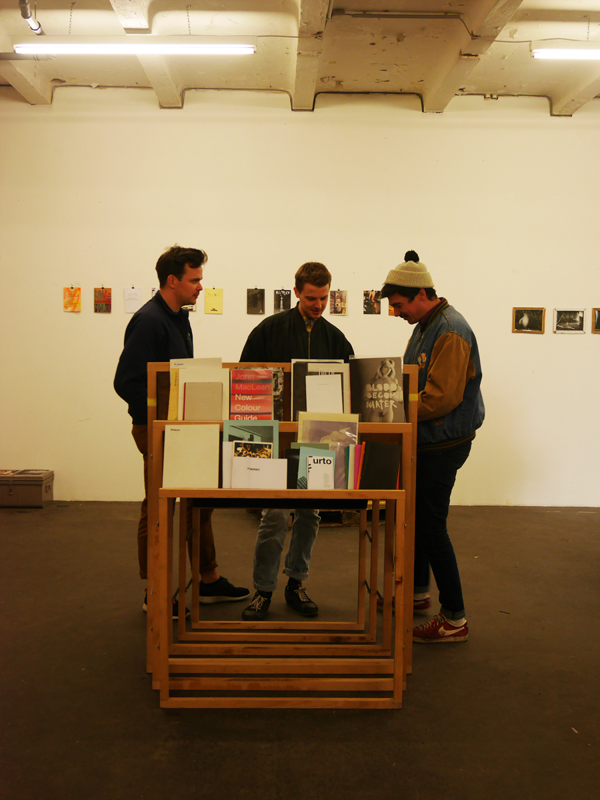
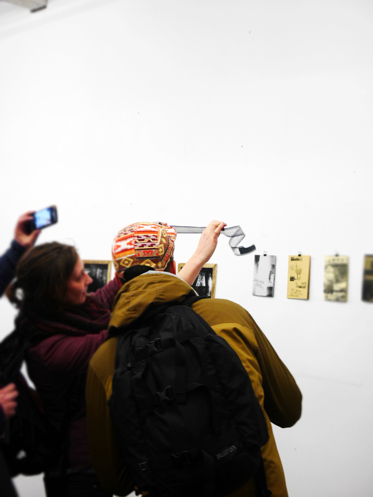
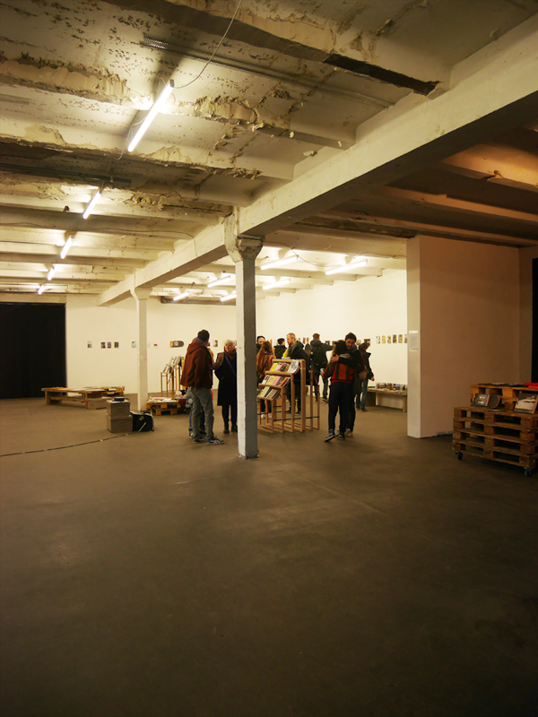

Im April des Jahres 2014 gab es in Berlin eine wunderbare Ausstellung
mit einem sonderbaren Bibliotheksbezug. Genau genommen war es sogar
keine Ausstellung, sondern eine temporäre internationale Bibliothek, nur
dass sie eben dort ihre Regale aufschlug, wo Friedrichshain das am
konsequentesten und sichtbarsten erfüllt, was der Mythos Berlin an
Off-Kultur (falls man Off-Kultur noch so nennt) verspricht: in der Urban
Spree Gallery zwischen Warschauer und Revaler Straße, dort wo
Skateboarder, Drogenhändler, Punks aller Haarfarben, Musiker aller
Richtung und Touristen aller Herren Länder aufeinandertreffen. Kein
schlechter Ort für eine Bibliothek also. Zumal für eine, deren Bestände
die Umgebung perfekt zu spiegeln scheinen.

Wir waren, nachdem wir über das wunderliche und ein bisschen
unterschätzte Medium Tumblr die Zine-Library entdeckten, außerordentlich
neugierig, wie eine solche Art Bibliothek außerhalb der Bibliothek
funktioniert. Und zwei der Zine-BibliothekarInnen erklärten uns
bereitwillig, was hinter dieser Idee steckt.

Zines of the Zone war im Frühjahr und Sommer 2014 eine Fahrbücherei. Mit
einer kleinen europäischen Förderung ausgestattet, tourte das Team um
die Fotografen Julie Hascoët und Guillaume Thiriet kreuz und quer über
den Kontinent, von Lissabon über Belgrad und Berlin nach Oslo, Warschau,
Nantes, Paris um jeweils für zwei bis drei Tage einen
nicht-repräsentativen (etwas anderes war unmöglich), stattdessen aber sehr
einzigartigen und dabei sehr umfänglichen und wachsenden (jede Station
ergänzte die Kollektion um weitere lokale Zine-Stücke) Bestand an das
interessierte Publikum zu vermitteln. Wie der Tour-Tumblr zeigt, dauert
die Reise weiterhin an (letzte Stationen: Zürich, Limoges, siehe
<http://blogznzn.tumblr.com/>).

Diese Bibliothek ist wirklich ein wachsender Organismus, weitgehend auf
Schenkungen aufbauend und dabei beziehungsweise dadurch auf
Zufallsbegegnungen. Vollständigkeit wird nicht angestrebt und wäre auch
nicht anstrebbar. Die Motivation für Zine-Produzenten etwas beizutragen
ist selbstredend außerordentlich hoch: Eine größere Verbreitung und vor
allem Wahrnehmung von Zines innerhalb ihrer peer group, in der
Einzelausgaben häufig gar nicht breitensichtbar werden, ist trotz aller
digitalen Optionen nur mit solchen Projekten realisierbar.

In Berlin gab es sogar zwei Stationen: neben der Urban Spree Gallery,
die vor allem eine Bestands- und Kulturvermittlung an einer heterogenes
Publikum ermöglichte, stand noch ein interaktiver Bibliothekstag der
offenen Tür bei der exp12-Galerie im Prenzlauer Berg auf dem Tourenplan.

War die Friedrichshainer Schau vor allem eine der zufälligen Begegnung
und der weitläufigen Nutzung, trafen sich in der Galerie des ruhigeren
Winsviertel vor allem Künstler, Fotografen und vor allem Zine- und
Independent-Zeitschriftenverleger zum Erfahrungsaustausch und zum
Netzwerken.

Die Zines-of-the-Zone-Bibliothek ist in dieser Funktion auch eine Art
Arbeits- und Mittelpunktsbibliothek vor allem für eine Gruppe kreativ
Tätiger, denen so eine Spezialbibliothek zwangsläufig mehr Inspiration
verspricht, als die Generalsammlungen der Stadtbibliotheken. Wobei
zugleich Julie und Guillame den Wunsch äußerten, mit klassischen
Bibliotheken zusammen zu arbeiten und die Sammlung dort zu präsentieren,
was die Zine-Kultur auch für anderes als das meist dann doch
szeneübliche Publikum erkundbar machen würde. Gerade weil Zines in
kleinen, spezifischen Zirkeln und abseits des üblichen Buchhandels
verbreitet werden, ist es für Außenstehende kaum möglich, mit dieser
medialen Form überhaupt in Kontakt zu kommen. Auf die Frage, ob
Bibliotheken Zines sammeln sollten, antwortet Julie entsprechend sofort:
Sie könnten es nicht einmal. Hin und wieder gibt es Versuche, aber dann
entziehen sich die Materialien den gängigen Erschließungssystematiken
und landen beispielsweise bei den Graphic Novels.

Die Motivation von Julie ist weitaus näher am Kern des traditionellen
Bibliothekswesens, als man möglicherweise zunächst vermutet. Ihre
Inspirationsquelle heißt Aby Warburg und was sie antreibt, ist die Sorge
um die Vergänglichkeit. Gerade in Kleinauflagen hergestellte Ephemera
wie Zines sind grundsätzlich vom Verschwinden bedroht. Dass neue
Publikationsformen zu einem Boom des *Self-Publishings* und damit auch
zu einem Wachstum der Zahl und Vielfalt von Zines und Zine-ähnlichen
Publikationen führt, erleichtert die Sache nicht unbedingt,
multipliziert sich damit zugleich die Unüberschaubarkeit dessen, was
geschieht. Mit dem Erhaltenwerden oder Verschwinden von Zines geht es
zugleich um das Bewahren einer ganz bestimmten Form von Kultur, die eben
nicht kanonisiert oder überhaupt kanonisierbar ist, sondern die
Schmelzpunkte des Kreativen, die Rohschnitte einer sich entwickelten
Formenvielfalt kulturellen Ausdrucks fasst. In diesen Materialien
bündeln sich vielleicht nicht die großen Weltentwürfe sondern eher
kleine Geschichten. Aber es sind Geschichten, es ist kulturelles Erbe
und dieses verdient es, bewahrt zu werden so wie die Geschichten es
verdienen, erzählt zu werden. Zines of the Zone zeigt diese Arbeiten und
Geschichten. Ob es sie auch bewahren können wird steht auf einem anderen
Blatt.

Zugleich spielt die Erzählform selbst eine Rolle: Die
Zines-of-the-Zone-Library dokumentiert, was in der Zine-Kultur wie
geschieht. Und schließlich betont Julie noch einen weiteren Aspekt: Es
gibt in der so genannten Generation Y, deren spätere Hälfte man im heute
im Herbst 2014 vielleicht noch eher als postdigital bezeichnen würde,
eine Reihe von Menschen, die gerade angesichts der Allgegenwart des
Digitalen eine neue Sensibilität für das Materielle entwickeln,
vielleicht auch eine Art Sehnsucht nach dem Realen, gerade weil sich der Großteil
auch des kreativen Handelns im Virtuellen vollzieht.

Den Bezugspunkt bilden dabei vorrangig aber nicht ausschließlich Zines.
Auch kleinere Zeitschriften vom Kaliber dessen, was man in Berlin
vielleicht Do-You-Read-Me-Kultur (nach dem passenden Fachgeschäft)
nennt, Künstlerbücher und ähnliche Publikationen finden Eingang in die
Sammlung, sofern sie nicht als Einzelstück sondern mindestens in einer
Kleinauflage vorliegen. Die organische Bibliothek der Zines kann auch
das passend in sich aufnehmen, sofern es irgendwie stimmig erscheint und
das zweite Zentralkriterium erfüllt: Es muss sich um eine unabhängige
Publikation handeln, die außerhalb des regulären Verlagswesens erschien.
Der kulturellen Verankerung der BibliotheksgründerInnen ist der
Schwerpunkt Fotografie zu verdanken. Fotozines sind zweifellos eine
dominante Form, eine Art haptische Variation der blühenden
Tumblr-Kultur. Diese Zines sind in diesem Sinn selbst
Dokumentationsarbeiten der Fotografen beziehungsweise Visual Artists,
die sich so selbst ein gedrucktes Portfolio erstellen. Die Qualität
dieser Ausgaben schwankt zwischen Fotokopier-Esprit und äußerst
professionellen Broschüren, wie sie Hersteller wie Pogobooks
<http://www.pogobooks.de/content/news.html>
produzieren.

Die Groberschließung der Sammlung erfolgt mit dem Anspruch, einen
Zugangspunkt anzubieten und spiegelt sich am Rande ebenso in der
Aufstellung, wobei die Bestandspräsentation auch im Umfang maßgeblich
vom Ausstellungsort geprägt wird. Im Normalfall kann nur eine Auswahl
des gesamten Bestandes gezeigt werden. Die Bestandsverwaltung erfolgt
auf dem Laptop mittels Excel. Der OPAC ist ein Tumblr
(<http://zinesofthezone.tumblr.com/>)
ohne weitere Sacherschließung aber mit hohem Serendipity-Potential. Das
gilt auch für die physische Sammlung, wobei Julie und Guillaume
betonten, wie wichtig die direkte Kommunikation mit den Besuchern im
Sinne des Vermittelns von Kenntnissen über diese Kultur ist.

Und vielleicht, so könnten wir ergänzen, die direkte Kommunikation mit
Menschen, die einen etwas theoretisierteren Blick auf den Gegenstand
werfen und dennoch nicht minder staunen. Erstens über die unglaubliche
Bandbreite und Vielfalt (auch in der Form), die das Realmedium der Zines
zu fassen versteht. Zweitens über die Leidenschaft, mit der gerade
Vertreter aus der Generation der (Post-)Digital-Natives mit einer
Materialkultur experimentieren, die viele Vertreter der Medieneliten
älterer Jahrgänge längst als anachronistisch abgeschrieben haben. In
gewisser Weise manifestiert sich hier eine Grundfunktion der
Zine-Kultur: Das Unterlaufen von Mainstreamansprüchen und -mustern der
Kultur. Das bisschen Social Media und digitale Narrativität, die sich
die Hubert-Burda-Think-Tanks als Leitsterne der medialen Gegenwart
ausmalen, wird bei Bedarf ganz nebenbei mitbespielt. Und schließlich
staunen wir über die Bereitschaft, sehr viel Zeit, auch ein paar eigene
Ersparnisse und sehr viel unbezahltes Engagement in eine
Herzensangelegenheit zu investieren, von der überhaupt nicht absehbar
ist, was am Ende stehen wird. Fraglos ist Zines of the Zone auch ein
ganz persönliches Abenteuer. Wie schön, dass die Idee der Bibliothek so
etwas hergibt.

---

**Ben Kaden** ist Bibliotheksforscher (heise.de) aus Berlin.
